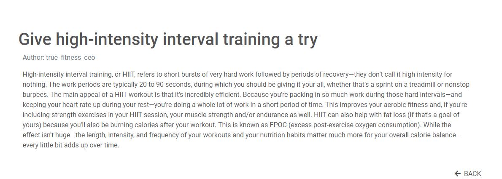
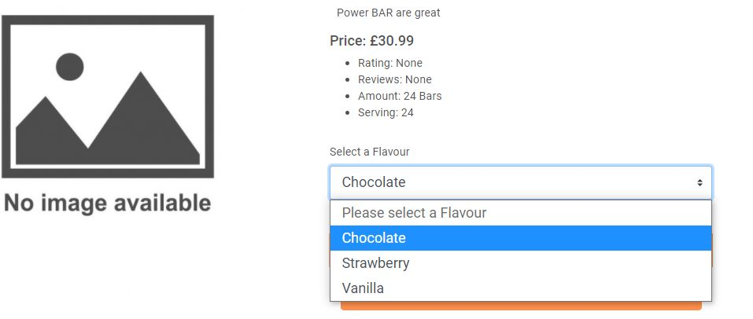
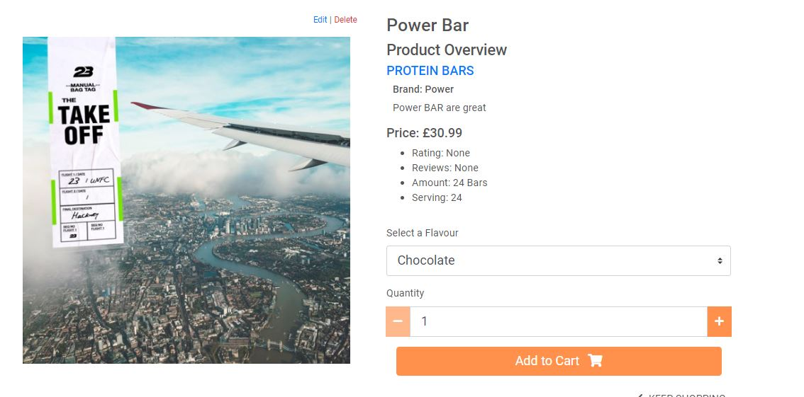
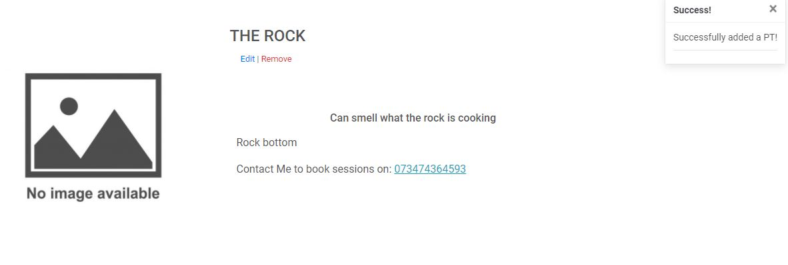

# True Fitness Gym

This website is for a gym to promote people to get active by displaying people transformations.  There is a gym where they can join and find the location of the gym. The site also allows users to purchase fitness supplements to help them achieve their fitness goals. Plus, users can register an account to make purchasing products quicker and see their order history and update their information. On this site visitors can view gym tips and hire Personal Trainers on weather they are available or not. 

## <i> Full Stack Frameworks With Django - Code institute </i>

---
> **True Fitness Gym** Making Your Fitness Goals Come True
---

## Demo

[Live Demo](https://brandon-true-fitness.herokuapp.com/)

[Mockup Here](readme/True-Fitness-2.pdf)

## Table of Contents

> 1.  [**UX**](#ux)
> 2.  [**Features**](#features)
>     - [**Existing Features**](#existing-features)
>     - [**Homepage**](#homepage)
>     - [**Gym Tips Page**](#gym-tips-page)
>     - [**Hire PT Page**](#hire-pt-page)
>     - [**Products Page**](#product-page)
>     - [**Cart Page**](#cart-page)
> 3.  [**Features Left to Implement**](#features-left-to-implement)
> 4.  [**Technologies Used**](#technologies-used)
> 5.  [**Testing**](#testing)
> 6.  [**Deployment**](#deployment)
>     - [**The local deployment**](#the-local-deployment)
>     - [**The Heroku deployment**](#the-heroku-deployment)
> 7.  [**Credits**](#credits)
>     - [**Content**](#content)
>     - [**Media**](#media)
>     - [**Acknowledgements**](#acknowledgements)

## UX

### User Stories

#### User

- As a user, I want the website to accessible on a spectrum of multiple devices
- As a user I want the that I can easily navigate through 
- As a user I want to able to register an account 
- As a user, I want to be able to change my password and account information
- As a user I want the ability to log in or log out whenever I want
- As a user I want to view a wide range of products 
- As a user I to view details about each product 
- As I user I want to view and edit the products before purchasing 
- As a user I want the ability to purchase products
- As a user, I want a place where I can view all my order history that attached to my account.
- As a user I want to search up products by category or keywords
- As a user I want to view gym tips 
- As a suer I want to view Personal trainers and learn details about them and how to contact them 
- As user I want to know the location of the gym

#### Admin

- As admin I want to log in 
- As admin I want to apply CRUD functionality to my products, gym tips and the personal trainer at gym
- As admin I want to view the orders the have been made 
- As admin I want to see how many users the website has

[Back to Top](#table-of-contents)

## Features

This website allows users to navigation smoothly between pages, purchase products, create accounts, hire personal trainers, and read up on gym tips. 

### Existing Features

#### **Navbar**

The navbar allows the user to navigate through the main pages of the site such as the home, products, gym tips and etc page with the gym logo on the fight hand side with takes you to the home page.

#### **Homepage**

The has hero image that gets the users attention where there is a link to register account. On the homepage there a google maps view where user can get the location of the gym and see where it located. 

#### **Gym Tips Page**

Gym Tips page allows site visitors to read up gym tips that they might find useful and incorporate when they next workout.

#### **Hire PT Page**

This page allows users to view a wide range of personal trainer and see if they are available to trainer any potential client. If they are available there is a link to view more details about the personal trainer and gives you the user a method of contacting the personal trainer to organise training sessions.

#### **Products Page**

The product page allows the visitor to view all the product users can purchase and with a link to view more information about each product allowing users to select for different flavours if the product has a multiple flavour and select the quantity you want to add to the user’s cart.  The user can sort product by price, name and rating via the sort box in the right hand side of the page. The search bar where the users can search for products if they can find it through scrolling or if they do not want to scroll through the page and go straight to their desired product. Users can filter the product by the different categories of whey protein, amino acids, protein bars and protein drink displaying only the product that fit that category.

#### **Cart Page**

The cart page lets users know how much each item cost the total cost of all the items that are in the cart. The user is also permitted to update the quantity or remove the item if they wish too. The cart is where the gateway to the checkout page where the user enters their information to complete their purchase.

### Features Left to Implement

If I were to have more time and resources or do this project again, I would add a subscription service that is linked to the gym where the users pay a monthly fee through stripe that gives them access to the gym. I would add features like apple pay and google pay for people to pay on their phone and a PayPal feature too to make purchasing product easier. There are some items that have the potential to be sold in different amounts but at different price so I would implement a logic to incorporate that.  On the profile page would allow the user to add a profile picture and a field for their first name and surname to be saved in their user profile. Add a way personal trainer can create their own profile designed for them.

[Back to Top](#table-of-contents)

## Technologies Used

- HTML
- CSS
- JavaScript
- jQuery
- Python
- Django
- Bootstrap
- Heroku 
- GitHub
- Stripe
- Google Maps API
- Font awesome 
- Google fonts 

## Testing 

Looking at the project I feel like the needs of the users has been meet.

On all the pages there a navbar where the users can navigate through a range of different pages, I have checked that all the links work and direct you to the right page. The footer opens a new tab to different social media sites such as twitter, Instagram and Facebook.

One the homepage there is a google map with a map marker on the location of the gym, and when click on the address of the gym pops up allow people to find a route to the gym, and you can zoom in and out of to look at the area around the gym.

On the gym tips page there a list of previews of gym tips when the users clicks on the read more link that is allocated to the specific gym tip, the user is directed to a page where they can read the gym tip in full.

On the Hire PT page their a some information about each personal trainer which is their full name and an opening statement, if they are available to take on new client they the user can click on the contact me button where they be taken to a different page that shows the user the more information about the personal trainer such as a descriptions about the personal trainer and a contact number where if the user is interest they can call the personal trainer to arrange training sessions and discuss price. If the personal trainer is unavailable there’s a greyed-out button saying unavailable and the button is disabled so user can get the details of the personal trainer.

On the products page there is a search bar in the right-hand side of the website where users can search for product to narrow their options when they are browsing. If the user does not search anything in the search bar a message pops saying the users didn’t search anything.

On the same right-hand side there is a sort box to sort the product by name (A to Z) and vice versa and price for low to high and vice versa and users can also sort by rating high to low. Giving the user another search method when they are looking through the products that the true fitness has to offer.

On the product page there is a category bar where the user can filter the products on display based on the different that the user selected on the category bar that located under the product title. So, when the user clicks on a category all the product that under that category are shown when a pop up telling the user what category they have just selected.

When a user clicks on the purchase button it takes them to the product detail page where there more information about the product, in addition the user can pick for a variety on flavours if the product is not unflavoured and with that there an option where the user can select the quantity the user would want to purchase but the user is not allowed to select 0 or a number above 99 in one transaction.

When the user clicks on the add to cart the item that the user select will be added to the cart with a message informing the user has successfully added the product to the cart, in the message there a preview of what the user has added to their cart with a link to go straight to the checkout page if the user is sure they want to complete their purchase without making any adjustments.

On cart page the user can view what items they added plus letting them know how much each item cost and how their quantity cost, what flavour they select and how much one portion is. If they the customer decides to change their mind and no longer want the item, they have the option to remove it from the cart by clicking on the remove button. Where a pop up will ensure the user that they have successfully removed the desired item.

If the customer wants the same product but in a different flavour, they can add it to the cart, but it will have it appear as a separate item in the cart.

Another feature that the customer can access is on the cart page if the option to change the quantity of the item the same way they would in the product detail page, when or if they change the quantity the cart total and subtotal will update too to show the new price of their transaction and a pop up appear to inform the customer.

If the customer does not meet the requirement to get free delivery, they get told how much they need to spend to be entitled with free delivery if that something they want, and if not, they can see how much the delivery will cost.

When the customer sure they want the checkout there a checkout button located at the top and bottom of the cart page that takes them to a checkout page where the user must enter a few details so their purchase can be processed. In addition, the user will also have to enter their credit or debit card but since this a is a real store to test it, the card details that are entered are the stripe test numbers that are found on the stripe website under the testing section.

After a successful purchase user is escorted to the checkout success page where the user can see the information they entered in the form and they are also given an order number which is a reference to the order they made. Plus, you get notified that you made a successful transaction.

On the developer side when logging into the stripe dashboard you can see the transactions and if they failed or succeeded by clicking on the events tabs.

With every successful transaction an email gets sent out to the email the customer has provided with details about their order such as order number, date and time and the total of their order. Giving the customer reinsurance that their order has go through.

But if the user does not fill in the require field then the form does not go through and the user is shown which field, they need to fill in so their form can go through.

A bug that was found during checking out is that in the card details field when a user did not fill the zip or post code the users would not be directed to the checkout success page to overcome this problem the zip portion was removed use the code below.

If a user clicks on the join now button in the hero image or the join now link in the navbar they are taken to the registration page, where user can register an account by creating a username and entering an email where they can get given a confirmation link to finalise their registration and access the features of being an account holder.

On the log in page if the user has created an account and confirmed their email, they can login in. once they have logged in by entering either their email or username and password, the navbar changes by no longer showing the login link and join now link and displaying account and log out links in their place instead. They get a message to confirmed they have logged in.

If the user is using the website with a logged in account when they click on the account link and have their details saved or updated so, when they checkout from buying a product their details are preloaded, so they do not have to enter it themselves saving them time.

Another feature on the account page the is that the account holder can view their order history and if they click on the order number, they can see the confirmation page where they can review that order. 

If an admin logs in to the that can add product or personal trainers if there a was to be a new available. For access to this attribute the admin would click on the account link and there are two buttons where they can decide whether to add a new product or Personal trainer but, the two buttons are only visible to the admin and not an ordinary user. By click one of these buttons the admin is taken to the appropriate page where there is a form they must fill in and all the field that have asterisk are mandatory and if they no filled the form will not go through.

In the add product page if the product that being added has more, they one flavour, then in the flavor field then the admin will have to enter the flavours all in one word (no spaces) and separate each flavour with a comma.

When the admin I done filling in the add product form and clicks on the add product button they get transported to the product detail page and if the form is not filled with an image or image URL, the product gets given a default no picture available image.

But if the product form is filled with an image or an image URL or both then the product image is displayed.

On the product page and product details page both have an edit and delete product link that is only visible if an admin is logged in. If the admin clicks on the edit link, they are redirected to the product form with the information filled in alright always the admin to make adjustment to the product.

If the admin clicks on the delete link, then the product is removed and a message pops ups letting the admin know the product been deleted.

The add Personal trainer works the in similar way as the add product button and their also an edit and link that allows you to edit the personal trainer’s info but there is a remove link that removes the personal trainer for the website. 

On the account page if the admin clicks on the add personal trainer button, they are taken to the add product form and the need to at least fill in the mandatory fields which labelled with asterisk.

On the slug field in the add/edit PT form the input must be entered as one word and if the admin enters something with a containing a space, it causes an error if it the form goes through since the field must be a in slugField format which does not allow any space so there is a message on the top of the page with an example format and if the admin puts a space in the input field for slug the form doesn’t go through.

[Back to Top](#table-of-contents)

## Deployment

### **The local deployment**

To deployment this website local git and pip must be installed and connect to your repository to your GitHub account. Install all the required app using pip and put them in a requirements.txts file.

There are variables that cannot be exposed and must be keep hidden cause they are very sensitive information and if in the wrong hand can cause massive issue for the owner of that sensitive information. So, these variables we keep them in the gitpod variable where they are hidden when your repository are uploaded to github account they are not exposed for anyone to access. The way to access these variables you will have to use “getenv” or “environ.get”. 

#### List of variables 
- SECRET_KEY
- EMAIL_HOST_PASS
- EMAIL_HOST_USER
- STRIPE_PUBLIC_KEY2
- STRIPE_SECRET_KEY2
- STRIPE_SECSTRIPE_WH2

To run the sever locally you will have to type “python manage.py runserver” in the command line.

### **The Heroku deployment**

The website is hosted using Heroku that connected to GitHub, the master branch is then deployed to Heroku automatically so when new commits get added to Github they get transferred straightaway to Heroku. Using the requirements.txt file and adding a Profile which are need components for Heroku needs to create the app. Heroku gives us platform to deploy our code a server for anybody in the world to access through the internet.

All static files such as css files, JavaScript files and image file used in this project are stored using amazon web service (AWS) that has a service called S3 bucket where the static file are stored.

#### List of variables
- AWS_SECRET_ACCESS_KEY
- AWS_ACCESS_KEY_ID
- USE_AWS 

[Back to Top](#table-of-contents)

## Credits

### Content

The gym tips on this site originate from the two different websites which are called https://www.boxrox.com/category/training/training-tips/ and https://www.self.com/gallery/make-your-workouts-more-effective respectively. The Personal trainer information are collected for this website https://six3nine.com/trainers.

The products where gather through a database search engine https://www.kaggle.com/daniyaljavaid/sports-nutrition-supplements-with-ingredients but edited by me and changed up me using excel they convert to a json file.  

[true product csv file here](readme/true-product.csv)

The member stories that are located on the homepage comes taken for this website https://people.com/health/incredible-weight-loss-transformation-photos/.

### Media

All the images on this website have been collected from secondary sources, mostly from advanced google image search excluding the logo that is placed in the right-hand side of the navbar which is a primary source that I created using windows paint. The products images where collect from various website which can be found in the developer tool on the browser and if you click on the it takes you to the image source.

#### Images sources

- The hero image on the homepage of the gym: https://www.charlottehaven.com/media/1119/healthclub_traaning-og-faciliteter_fitness_topslider1920x1080_01.jpg
- The image of women using the exercise machine: https://www.charlottehaven.com/media/1122/healthclub_traaning-og-faciliteter_fitness_topslider1920x1080_04.jpg?width=1700&height=950&mode=crop
- The group in activewear: https://247fitness.co/public/uploads/blog-image/1512426536.jpg

### Acknowledgements 

For the completion project I will have to give acknowledgement to the coding institute tutor and my mentor for aided me throughout this project and being available to help when needed

Before starting this project, I some did research on different gym and gym supplement sites, while looking  for inspiration from a few websites such as https://www.puregym.com/, https://www.thegymgroup.com/ and https://www.myprotein.com/ examining their layout, colour scheme, pictures and content. I also researched colours that are associated with being active and having an active lifestyle.

The coding institute Project - Boutique Ado and Hello Django lessons were a big inspiration to this project plus with all these lessons that allowing me to use the knowledge I have received from the coding institute and applying to my project.

During this project there were a few obstacles that I needed to overcome but with the assistant of websites such as stackflow, w3schools.com that helped me find solutions for some of the problems that I encountered during this project.

[Back to Top](#table-of-contents)

